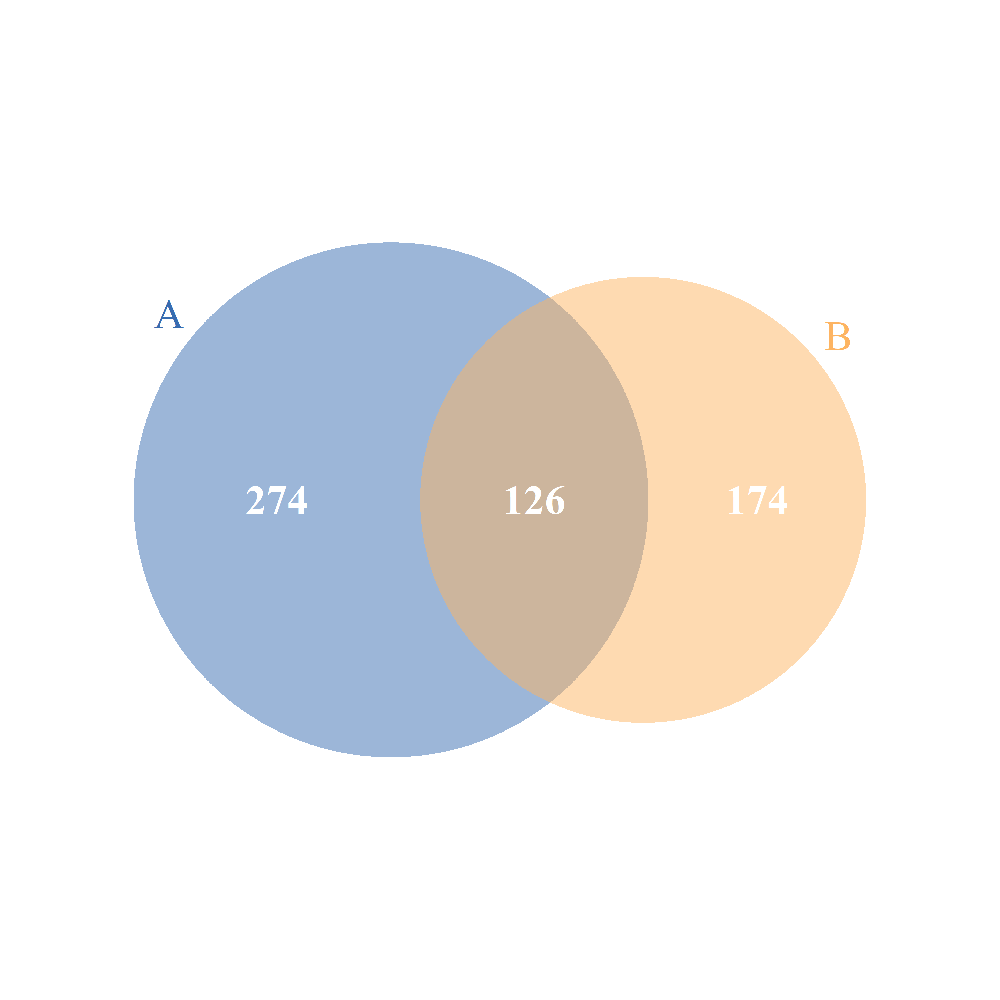
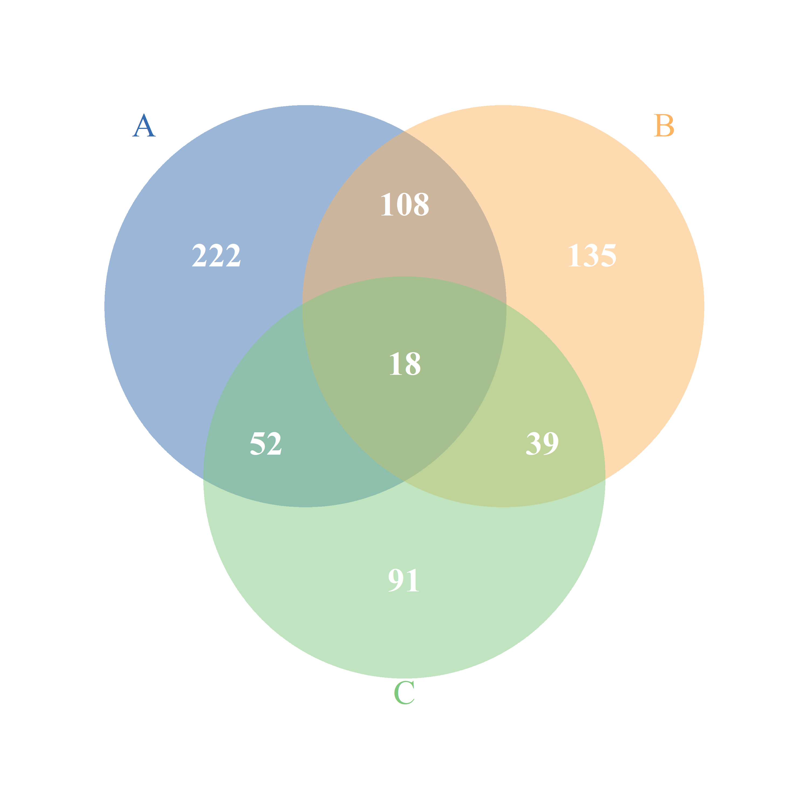
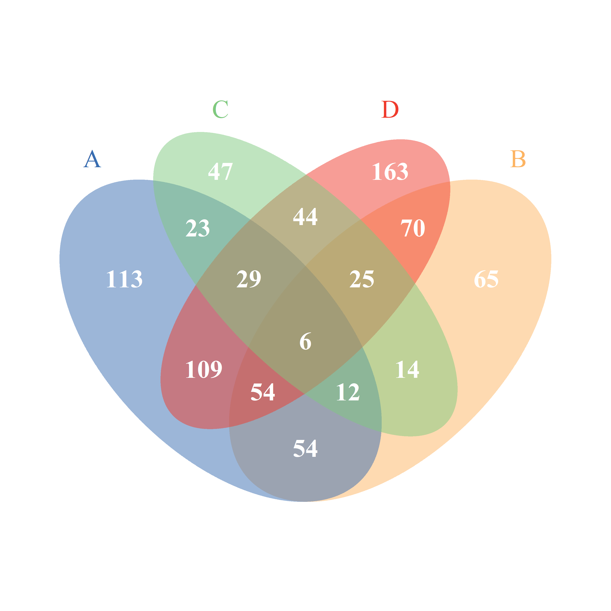
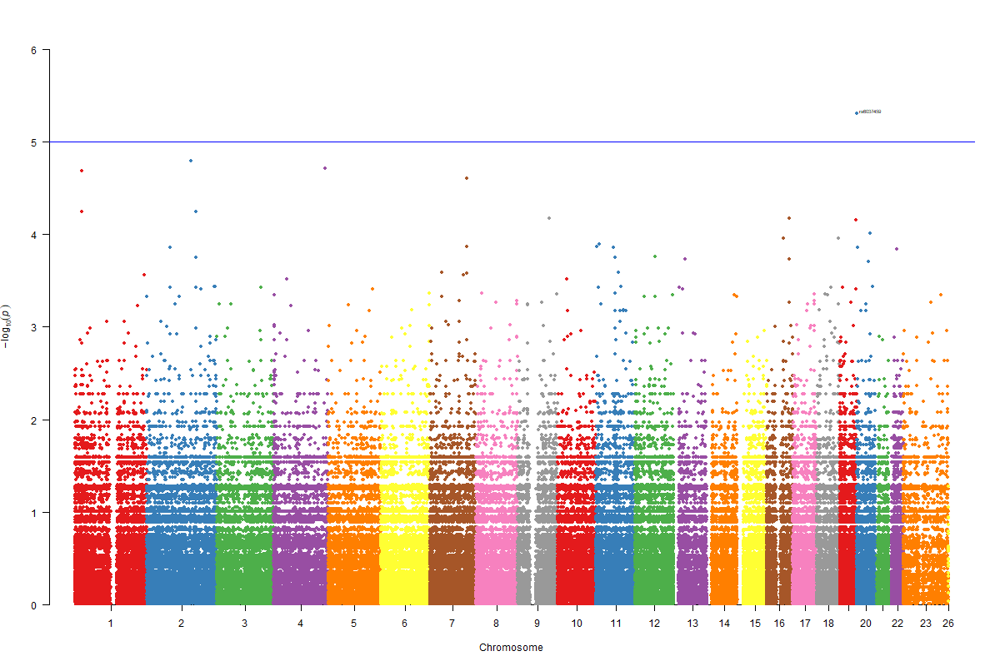
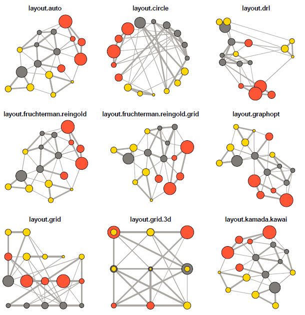

# onmath visualiztion

## venn plot

venn plot 使用 R 的 [VennDiagram](https://cran.r-project.org/web/packages/VennDiagram/VennDiagram.pdf) 包进行可视化,设定最大可以画4个 group 的 venn。

```r
oneName <- function() paste(sample(LETTERS,5,replace=TRUE),collapse="")
geneNames <- replicate(1000,oneName())
GroupA <- sample(geneNames,400,replace = F)
GroupB <- sample(geneNames,300,replace = F)
GroupC <- sample(geneNames,200,replace = F)
GroupD <- sample(geneNames,500,replace = F)
```

我们将 VennDiagram 封装在一个函数中,设置好一些基本的参数,当自己在实际项目中需要进行修改一些 VennDiagram 中的参数时,可以直接在函数中进行修改然后再保存运行。
```
fill_col <- c("#386cb0","#fdb462","#7fc97f","#ef3b2c")
venn_plot(venn_data = list(A=GroupA,B=GroupB),fill_colour = fill_col[1:2],file_name = 'venn_test_group2.png')
```


```
fill_col <- c("#386cb0","#fdb462","#7fc97f","#ef3b2c")
venn_plot(venn_data = list(A=GroupA,B=GroupB,C=GroupC),fill_colour = fill_col[1:3],file_name = 'venn_test_group3.png')
```


```
fill_col <- c("#386cb0","#fdb462","#7fc97f","#ef3b2c")
venn_plot(venn_data = list(A=GroupA,B=GroupB,C=GroupC,D=GroupD),fill_colour = fill_col,file_name = 'venn_test_group4.png')
```


## manhattan plot

manhattan plot 使用 R 的 [qqman](https://cran.r-project.org/web/packages/qqman/index.html) 包中的 manhattan 函数进行可视化。



## wgcna network

network plot 使用 R 的 [ggraph](https://github.com/thomasp85/ggraph) 包进行可视化。默认使用的 layout 是 kamada.kawai 关于所有的 layout 展示可以参考下面：



需要注意的是当 network 的数据量很大的时候(nodes > 1000)**不适合**使用 'fr' 的 layout,很消耗计算机资源。
